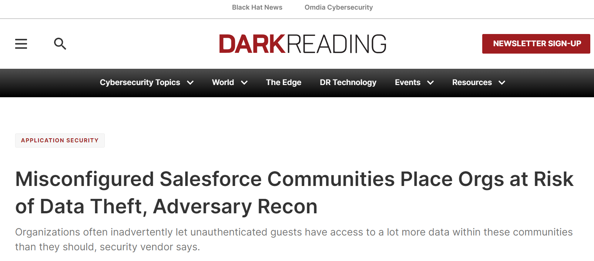
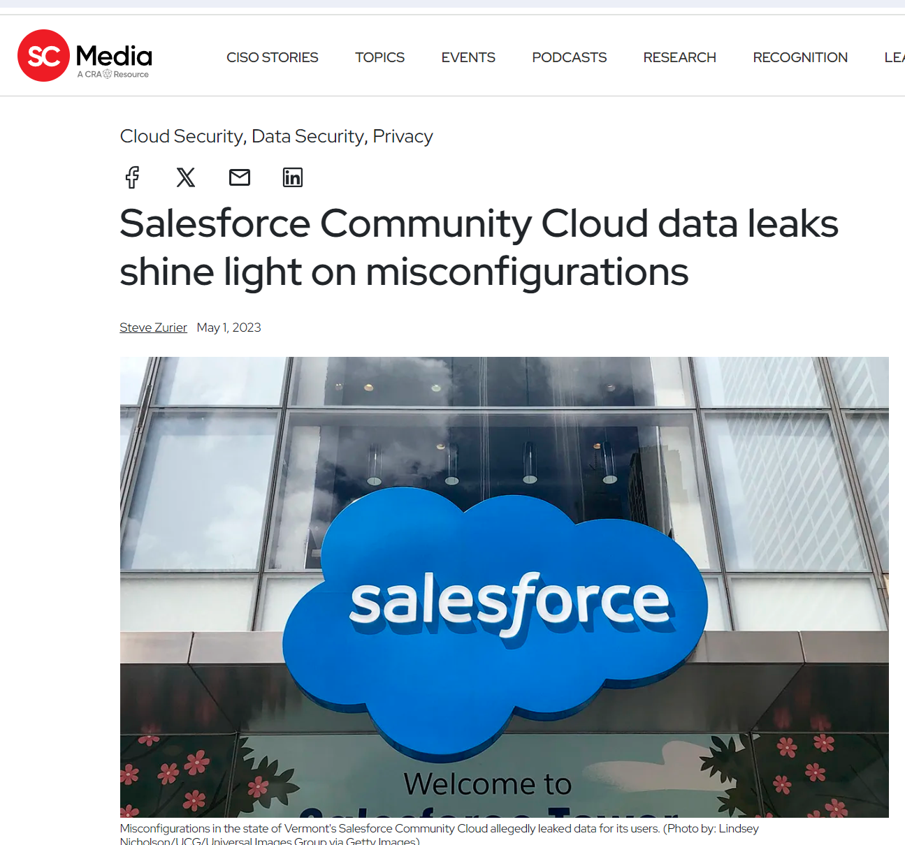
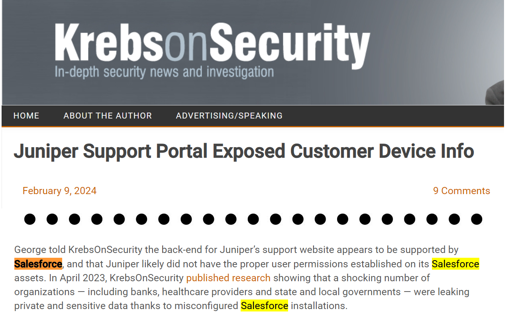
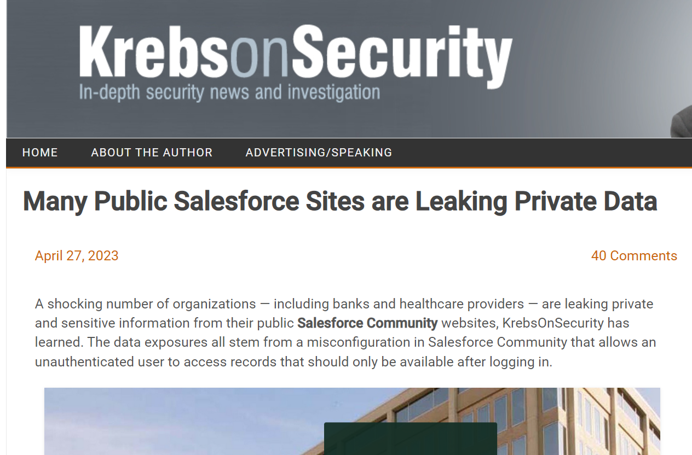
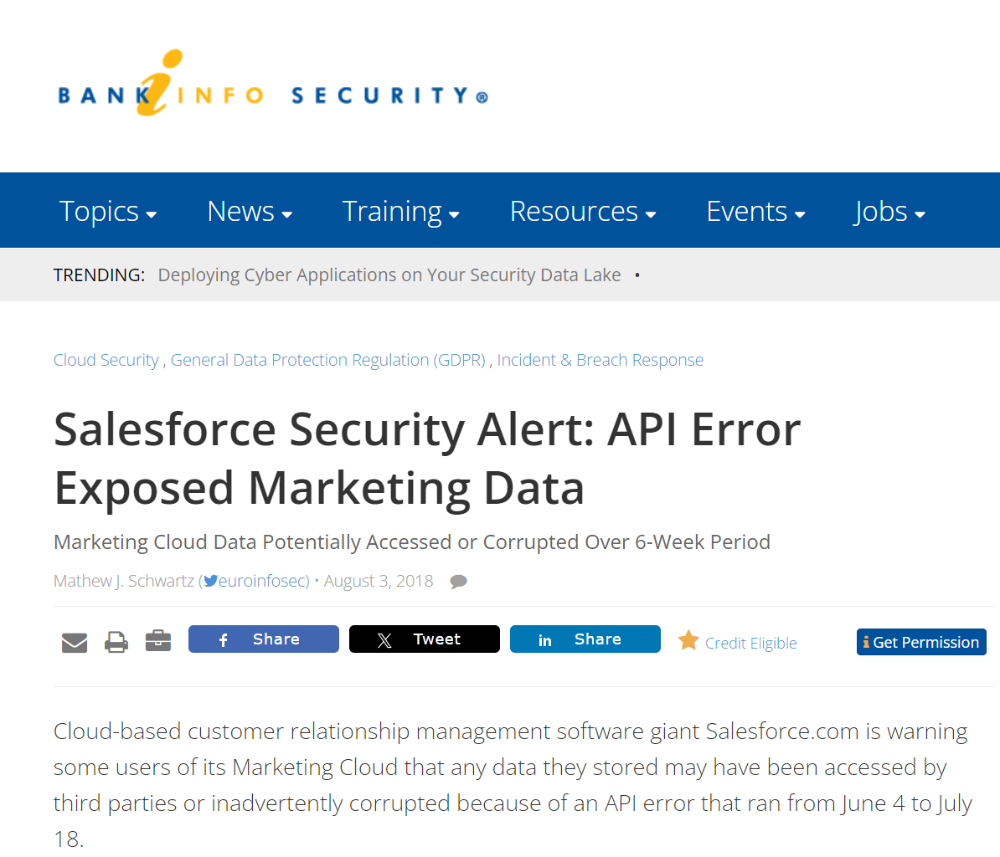
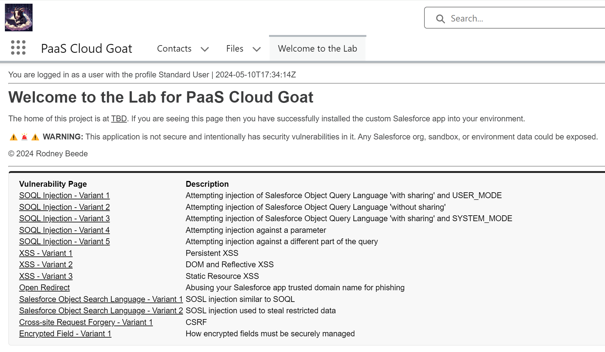

# What is a Custom Salesforce App?

- Salesforce.com
  - Salesforce is cloud-based CRM software (salesforce.com)
- Build Your Own Salesforce App (salesforce.com)
  - Classic apps
    - Tabs, objects, feeds
  - Lightning apps
    - Look and feel customization
- Languages
  - Apex (Java-like)
  - Visualforce
  - JavaScript

---

# Why Test Custom Salesforce Apps?

[https://krebsonsecurity.com/2024/02/juniper-support-portal-exposed-customer-device-info/](https://krebsonsecurity.com/2024/02/juniper-support-portal-exposed-customer-device-info/)

[https://www.scmagazine.com/news/salesforce-community-cloud-data-leaks-misconfigurations](https://www.scmagazine.com/news/salesforce-community-cloud-data-leaks-misconfigurations)

[https://krebsonsecurity.com/2023/04/many-public-salesforce-sites-are-leaking-private-data/](https://krebsonsecurity.com/2023/04/many-public-salesforce-sites-are-leaking-private-data/)

[https://www.bankinfosecurity.com/salesforce-security-alert-api-error-exposed-marketing-data-a-11278](https://www.bankinfosecurity.com/salesforce-security-alert-api-error-exposed-marketing-data-a-11278)

[https://www.darkreading.com/application-security/misconfigured-salesforce-communities-place-orgs-at-risk-of-data-theft-adversary-recon](https://www.darkreading.com/application-security/misconfigured-salesforce-communities-place-orgs-at-risk-of-data-theft-adversary-recon)

---

## PaaS Cloud Goat

https://github.com/Coalfire-Research/paas-cloud-goat

---

# Lightning (LWC) vs Apex

- VisualForce = page frontend markup
- Apex = backend controller
- Lightning = more modern page framework
  - Replaces Salesforce Classic UI
  - More AJAX or client-side heavy
  - Still uses Apex (and optionally) VisualForce
- URLs for pentesting
  - Lightning = https:// _org_ .develop.lightning.force.com/ __lightning__  __/n__ /XSS2
  - Apex(Classic) = https:// _org_ .develop.vf.force.com/ __apex__ /XSS2

---

# URL Forms

1. Lightning Tab = /lightning/o/CustomObject__c
2. Lightning Tab = /lightning/o/Contacts (built-in)
3. Apex Page = /apex/GuessPageName
4. Salesforce Classic Experience = /a0/l
   - List page
   - Easier to iterate through a0, a1, b1, aa1, etc.

---

# Salesforce Vulnerabilities

- XSS
- SOQL Injection (Salesforce Object Query Language)
- SOSL Injection (Salesforce Object Search Language)
- Open Redirect
- CSRF
- Encrypted Field Bypass

---

[Reporting Tips](reporting.md)
