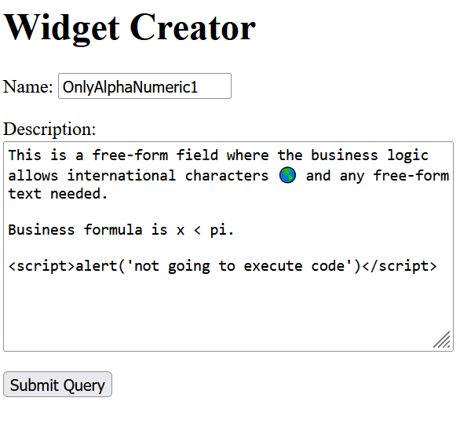
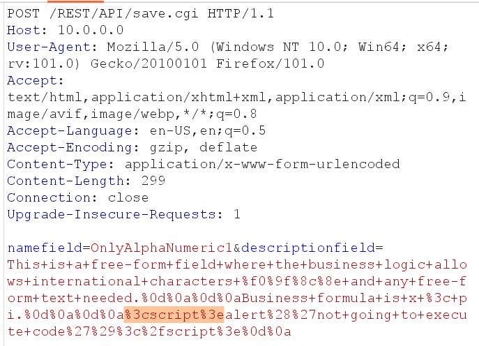
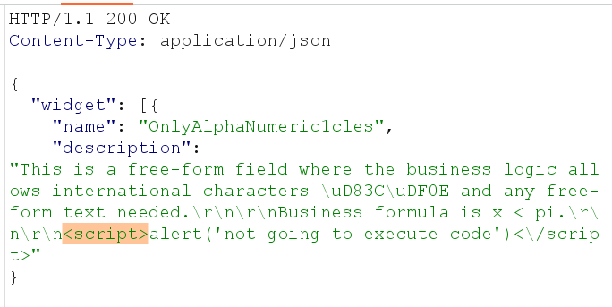

# OpenStack

- Swift is an object storage service
- API for adding objects
- Not filesystem storage
  - Object key names are not filenames
  - As for many other cloud providers almost any byte sequence can be used in the key name

---

# XSS a Cloud REST API

What is _not_ Cross-Site Scripting?

- Description field with ``

---

# REST API - HTTP Response and XSS

Just having tags doesn't make it a vulnerability

---

# What is Cross-Site Scripting?

- Is this a persistent XSS vulnerability?
  - Web UI parses JSON
    - Most libraries make this unlikely
  - But still a possibility (ಠ◡ಠ)
- What if the response was not?
  - Content-type: application/json

---

# XSS Backdoor via API

- Have this simple UI for uploading pictures
- The UI interface restricted filenames correctly
  - Just a-z and nothing else
- What if we don't use the upload button?

---

Next [Injection](injection.md)
